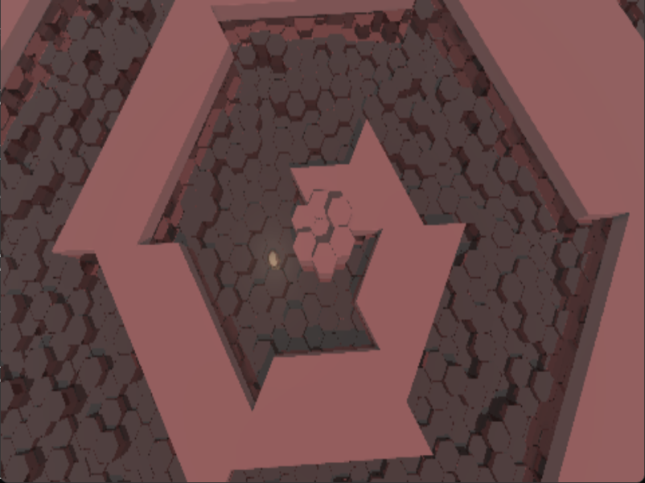

# Ray Marched Hexagon Game

This is a Super Hexagon clone game written in rust and webgpu. It uses a custom 3D graphics engine based on ray marching instead of a traditional pipeline. It is currently in an early development stage where key features are mostly done, but no real game content is in place yet.

Ray marching is a rendering technique that renders each pixel by stepping along the corresponding light ray in render space. Each step, the minimal distance to the scene is computed, then the ray origin is moved by this distance, this is repeated until sufficient distance to the scene is reached. This approach is generally less performant than traditional pipelines, but it makes certain graphics effects very easy to implement, for example reflection, refraction and water effects. There are ample examples of raymarching graphics on [shadertoy.com](https://www.shadertoy.com).

## Tools

Includes a small custom wgsl shader preprocessor using a //!include command and simple //!define commands, because wgsl doesn't support include out of the box. This is run automatically via build.rs during cargo run, if any of the shaders are outdated. See build.rs.

Also included is a simple build utility for asset files. This allows the user to specify a target file, dependency files and a transformation function, so that the target file is built from the dependency files if the target file is older than any of the dependencies.

## Commands

Build / Run:
cargo build
cargo run

Wasm build not working currently and hasn't for a while.

Build Wasm:
wasm-pack build --target web

Run Web Server:
python -m http.server 8080
127.0.0.1:8080

Compile and Run:

cmd:
wasm-pack build --dev --target web && python -m http.server 8080

powershell:
(wasm-pack build --dev --target web) -and (python -m http.server 8080)

## TODOs

Gameplay

* Fix sideways collision between character and obstacle
* Frontal collision between character and obstacle should maybe use better 
* Enough patterns to fill 30 seconds of unique gameplay
* Pattern difficulty progression

Animation

* Pulsing of ground color
* Light and Fog. https://www.shadertoy.com/view/msdXzH
* Sky (seen via reflection) or large fractal in the sky
* Pulsing of camera / scale
* Slow ground height animation
* Rotating Camera should have more interesting movement
* Changing color

Optimizations

* Noise texture
* Cone Tracing

Other

* Screen resolution toggle via hotkey
